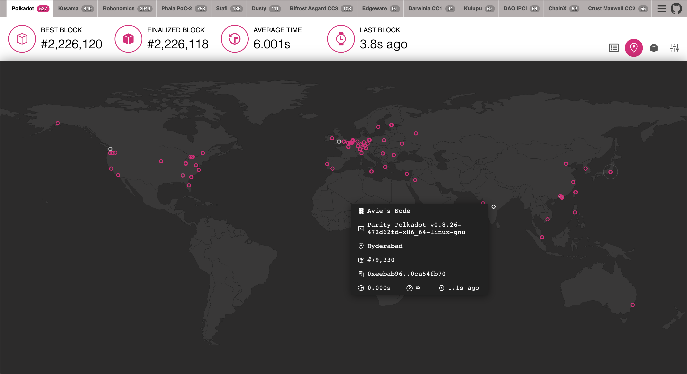

# Run-A-Kusama-Or-Polkadot-Node-And-Add-It-To-Telemetry

## Polka Node Proof

---
### Challenge
Download the latest binary release or build Polkadot or Kusama from source, and run your node. Add it to telemetry as per the README instructions, and let us know when your node appears in the telemetry.polkadot.io list!
Submission requirements

Node has to be on telemetry, fully synced, for at least 24 hours. The syncing will take a while, so be patient. Pro tip: run it with the --wasm-execution=compiled flag to quadruple sync speed! Additional pro tip: download a pre-synced Kusama database from Dot Leap to get a head start!

#### Resources
- https://github.com/paritytech/polkadot/releases
- https://github.com/paritytech/polkadot/#connect-to-polkadot-mainnet
- https://dotleap.com/how-to-import-a-pre-synced-kusama-database/

